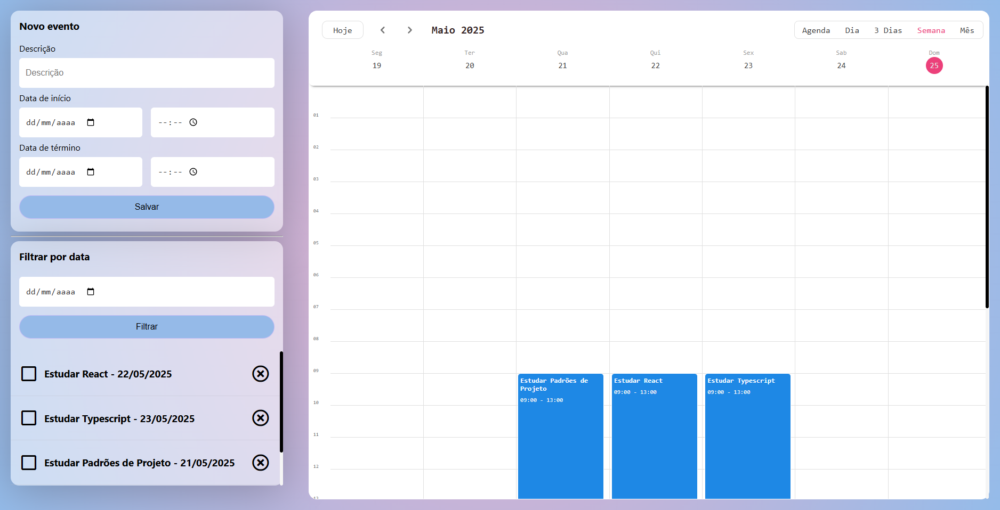

# Event Tracker - Kalend Alura



## Menu

- [Descrição](#descrição)
  - [Principais recursos incluem](#principais-recursos-incluem)
- [Tecnologias Utilizadas](#tecnologias-utilizadas)
- [Estrutura de Pastas](#estrutura-de-pastas)
  - [Arquivos Principais](#arquivos-principais)
- [Como Instalar e Rodar o Projeto](#como-instalar-e-rodar-o-projeto)
  - [Configuração](#configuração)
  - [Casos de Uso Comuns](#casos-de-uso-comuns)
  - [Solução de Problemas](#solução-de-problemas)
- [Projeto ao Vivo](#projeto-ao-vivo)
- [Fluxo de Dados](#fluxo-de-dados)
- [Licença](#licença)
- [Autor](#autor)

## Descrição

O **Event Tracker - Kalend Alura** é uma aplicação de gerenciamento de eventos desenvolvida durante o curso da Alura. A aplicação permite criar, visualizar, filtrar e gerenciar eventos em um calendário interativo, oferecendo uma interface moderna e intuitiva para organização de compromissos e atividades.

A aplicação utiliza o componente Kalend para renderização do calendário e Recoil para gerenciamento de estado global, proporcionando uma experiência fluida e responsiva.

### Principais recursos incluem

- ✅ **Criação de Eventos**: Formulário completo para adicionar novos eventos com descrição, data/hora de início e fim
- 📅 **Visualização em Calendário**: Interface de calendário interativa usando a biblioteca Kalend
- 🔍 **Filtros Avançados**: Sistema de filtros para visualizar eventos por data específica
- ✏️ **Edição por Arrastar**: Funcionalidade drag-and-drop para reposicionar eventos no calendário
- 📱 **Interface Responsiva**: Design adaptável para diferentes tamanhos de tela
- 🎯 **Validações**: Prevenção de criação de eventos no passado
- 💾 **Persistência de Dados**: Integração com JSON Server para armazenamento local
- 🔄 **Estado Global**: Gerenciamento eficiente de estado com Recoil

## Tecnologias Utilizadas

- **React** 17.0.2 - Biblioteca principal para construção da interface
- **TypeScript** 4.5.4 - Superset do JavaScript com tipagem estática
- **Recoil** 0.7.7 - Biblioteca para gerenciamento de estado global
- **Kalend** 0.6.5 - Componente de calendário interativo
- **Moment.js** 2.29.1 - Biblioteca para manipulação de datas
- **SASS** 1.46.0 - Pré-processador CSS para estilização
- **CSS Modules** - Escopo local para estilos CSS
- **JSON Server** - Simulação de API REST para desenvolvimento

## Estrutura de Pastas

```
event-tracker/
├── public/                 # Arquivos públicos
│   ├── index.html         # Template HTML principal
│   └── favicon.ico        # Ícone da aplicação
├── src/
│   ├── components/        # Componentes React reutilizáveis
│   │   ├── Calendario/    # Componente do calendário principal
│   │   ├── Card/          # Componente de cartão wrapper
│   │   ├── Evento/        # Componente individual de evento
│   │   ├── Filtro/        # Componente de filtros
│   │   ├── Formulario/    # Formulário de criação de eventos
│   │   └── ListaDeEventos/ # Lista de eventos lateral
│   ├── interfaces/        # Definições de tipos TypeScript
│   │   ├── IEvento.ts     # Interface do evento
│   │   └── IFiltroDeEventos.ts # Interface dos filtros
│   ├── state/             # Gerenciamento de estado Recoil
│   │   ├── atom.ts        # Átomos do Recoil
│   │   ├── hooks/         # Hooks customizados
│   │   └── seletores/     # Seletores do Recoil
│   ├── App.tsx            # Componente principal
│   └── index.tsx          # Ponto de entrada da aplicação
├── database/
│   └── db.json            # Base de dados local (JSON Server)
└── package.json           # Dependências e scripts
```

### Arquivos Principais

- **`src/App.tsx`**: Componente raiz que organiza o layout principal com RecoilRoot
- **`src/components/Calendario/index.tsx`**: Implementa o calendário usando Kalend com funcionalidades de drag-and-drop
- **`src/components/Formulario/index.tsx`**: Formulário para criação de novos eventos com validações
- **`src/state/atom.ts`**: Define os átomos do Recoil para estado global dos eventos
- **`src/state/seletores/index.ts`**: Seletores para filtros e carregamento assíncrono de dados
- **`database/db.json`**: Arquivo de dados simulando uma API REST

## Como Instalar e Rodar o Projeto

### Pré-requisitos

- Node.js (versão 14 ou superior)
- npm ou yarn

### Instalação

1. **Clone o repositório**:

   ```bash
   git clone https://github.com/Melksedeque/event-tracker.git
   cd event-tracker
   ```

2. **Instale as dependências**:
   ```bash
   npm install
   # ou
   yarn install
   ```

### Configuração

1. **Inicie o JSON Server** (em um terminal separado):

   ```bash
   npx json-server --watch database/db.json --port 8080
   ```

2. **Inicie a aplicação React**:

   ```bash
   npm start
   # ou
   yarn start
   ```

3. **Acesse a aplicação**:
   - Frontend: [http://localhost:3000](http://localhost:3000)
   - API (JSON Server): [http://localhost:8080](http://localhost:8080)

### Casos de Uso Comuns

#### Criando um Novo Evento

1. Preencha o formulário "Novo evento" na lateral esquerda
2. Defina descrição, data/hora de início e fim
3. Clique em "Salvar" para adicionar ao calendário

#### Filtrando Eventos

1. Use o componente de filtro para selecionar uma data específica
2. A lista e o calendário serão atualizados automaticamente

#### Editando Eventos

1. No calendário, arraste e solte eventos para alterar horários
2. As mudanças são salvas automaticamente

### Solução de Problemas

**Erro de conexão com a API**:

- Verifique se o JSON Server está rodando na porta 8080
- Confirme se o arquivo `database/db.json` existe

**Eventos não aparecem**:

- Verifique o console do navegador para erros
- Confirme se a API está retornando dados em `http://localhost:8080/eventos`

**Problemas de build**:

- Limpe o cache: `npm start -- --reset-cache`
- Reinstale dependências: `rm -rf node_modules && npm install`

## Projeto ao Vivo

Para ver uma demonstração ao vivo do projeto, visite: [Event Tracker - Kalend Alura Demo](https://event-tracker-eight-pearl.vercel.app)

## Fluxo de Dados

A aplicação segue um fluxo de dados unidirecional usando Recoil:

```
┌─────────────────┐     ┌──────────────────────┐    ┌───────────────────────┐
│   Formulário    │───▶│  useAdicionarEvento  │───▶│  listaDeEventosState  │
└─────────────────┘     └──────────────────────┘    └───────────────────────┘
                                                               │
                                                               ▼
┌─────────────────┐     ┌───────────────────────┐    ┌───────────────────┐
│   Calendário    │◀───│ eventosFiltradosState │◀───│  filtroDeEventos  │
└─────────────────┘     └───────────────────────┘    └───────────────────┘
                                                               ▲
                                                               │
┌──────────────────┐    ┌──────────────────┐        ┌────────────────┐
│  ListaDeEventos  │    │      Filtro      │───────▶│   Componente   │
└──────────────────┘    └──────────────────┘        └────────────────┘
```

### Principais Estados:

- **`listaDeEventosState`**: Armazena todos os eventos carregados da API
- **`filtroDeEventos`**: Controla os filtros aplicados à visualização
- **`eventosFiltradosState`**: Selector que combina eventos e filtros
- **`eventosAsync`**: Selector para carregamento assíncrono dos dados

## Licença

Este projeto está licenciado sob a Licença MIT. Veja o arquivo [LICENSE](https://github.com/Melksedeque/event-tracker?tab=MIT-1-ov-file) para mais detalhes.

## Autor

- GitHub - [Melksedeque Silva](https://github.com/Melksedeque/)
- FrontEndMentor - [@Melksedeque](https://www.frontendmentor.io/profile/Melksedeque)
- Twitter / X - [@SouzaMelk](https://x.com/SouzaMelk)
- LinkedIn - [Melksedeque Silva](https://www.linkedin.com/in/melksedeque-silva/)
